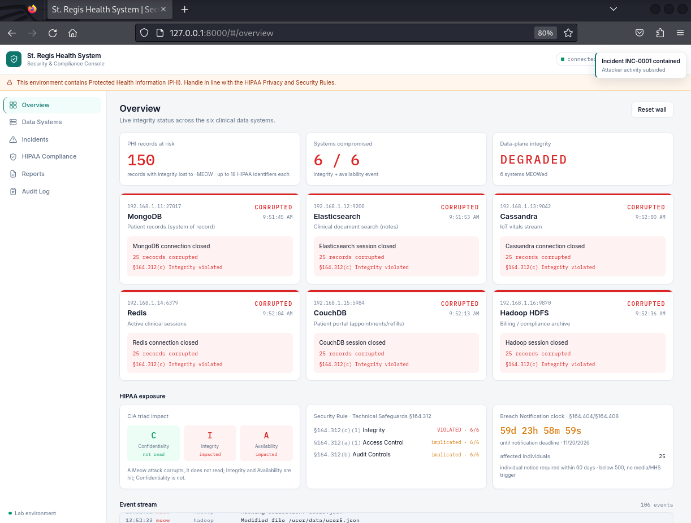
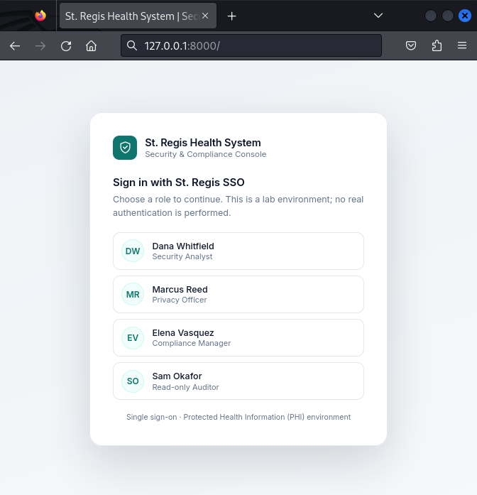
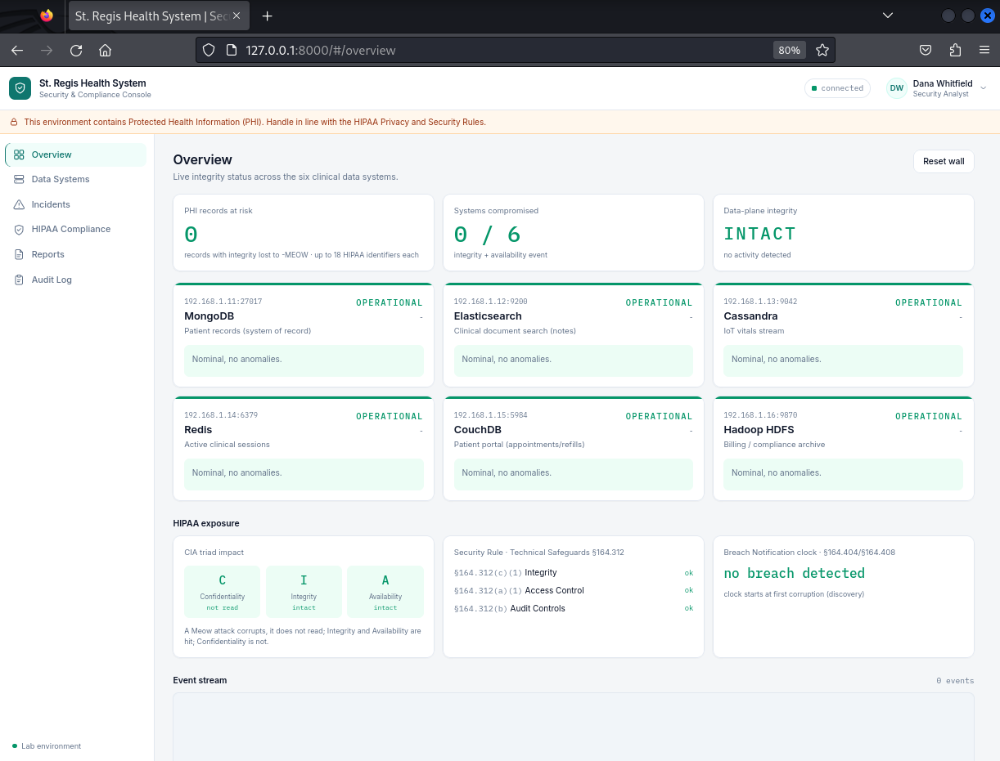
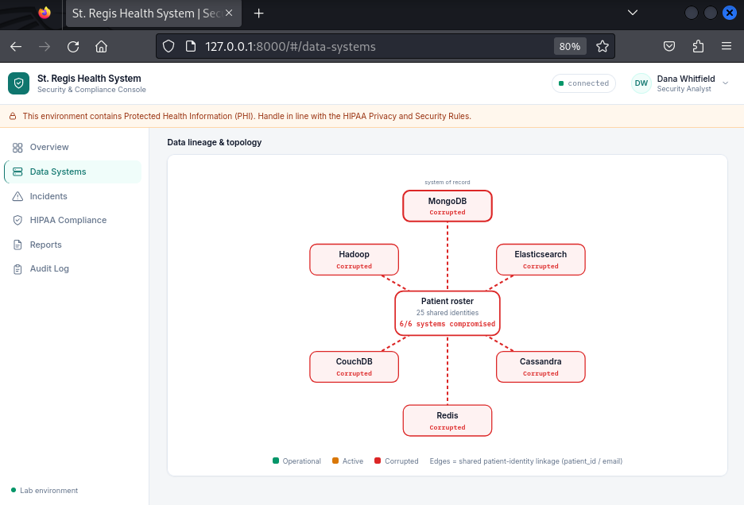
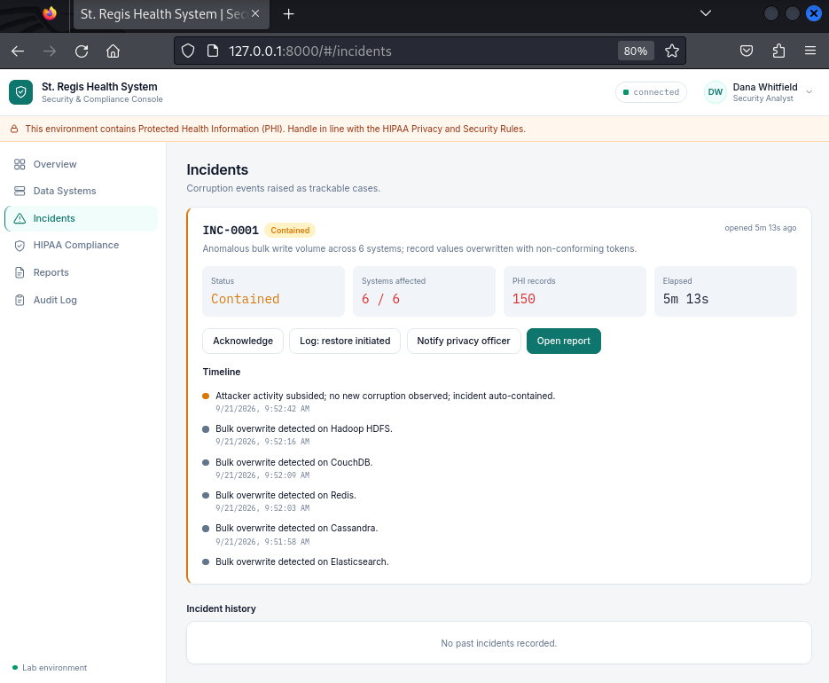
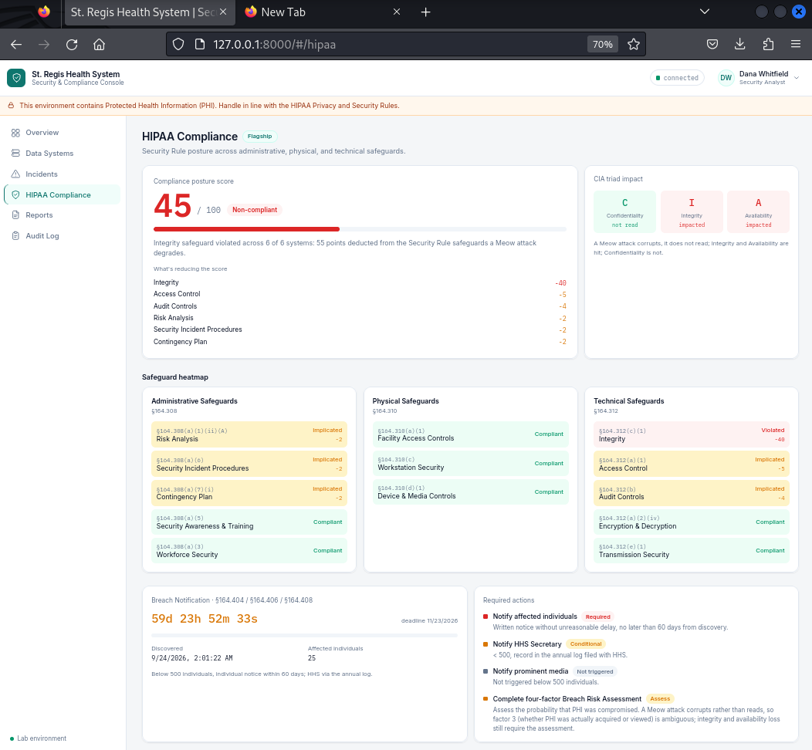
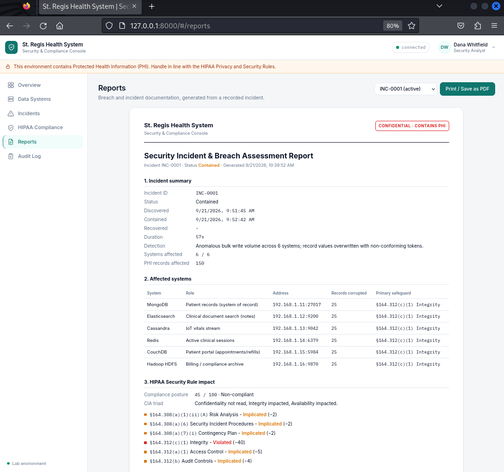
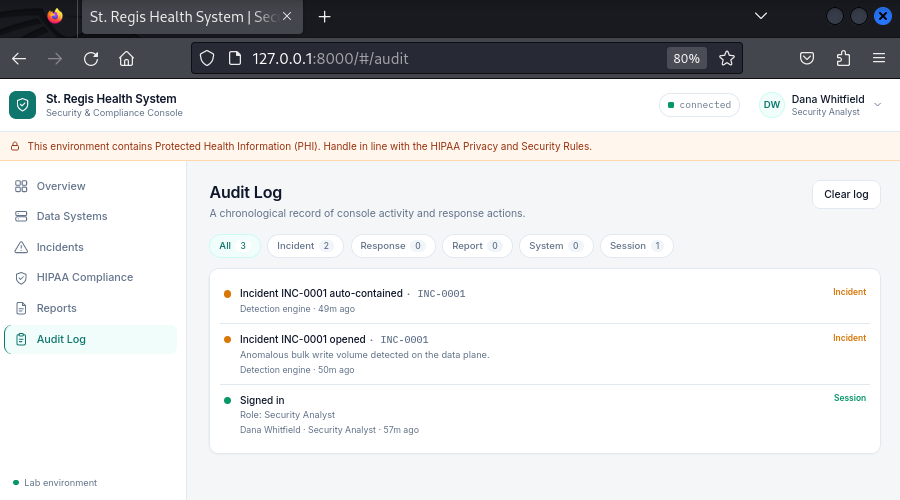

# MAD-CAT </br> [Meow Attack Data Corruption Automation Tool]


## Overview

MAD-CAT (Meow Attack Data Corruption Automation Tool) is a security tool that simulates data corruption attacks against multiple database systems. It supports single-target attacks and bulk CSV-based campaigns, in both credentialed and non-credentialed scenarios. Each attacker connects to a target, enumerates its databases and collections, and overwrites values with a random alphanumeric string followed by "-MEOW". This is a destructive integrity and availability attack, not data theft.

This repository pairs the attack tool with a self-contained lab and a live console:

- a dockerized six-database lab, seeded with a synthetic, HIPAA-shaped healthcare dataset (25 patients, no real PHI);
- a real-time Security and Compliance Console ("St. Regis Health System") that reads the attacker's own event log, shows the corruption unfolding across all six systems, and tracks it as a HIPAA incident.



*Figure 1. The live attack wall with all six systems corrupted (red) during a bulk MEOW attack.*

## Supported Database Services

The tool currently supports the following database services:

<div align="center">
  
  
  
  </br>
  
  
  
</div>

- **MongoDB** (port 27017)
- **Elasticsearch** (port 9200)
- **Cassandra** (port 9042)
- **Redis** (port 6379)
- **CouchDB** (port 5984)
- **Hadoop HDFS** (port 9870)

## The -MEOW Attack and the Lab

Every attacker runs the same short lifecycle: connect to the target, enumerate its databases and collections (skipping system databases), overwrite each value with a `{random}-MEOW` string, then close. The signature left behind in every corrupted field is the literal `-MEOW`.

The included lab runs all six services on a fixed private network and assigns each one a clinical role, so a single campaign shatters a realistic healthcare estate:

| Service | Address | Clinical role in the lab |
|---------|---------|--------------------------|
| MongoDB | 192.168.1.11:27017 | Patient records (system of record) |
| Elasticsearch | 192.168.1.12:9200 | Clinical document search (notes) |
| Cassandra | 192.168.1.13:9042 | IoT vitals stream |
| Redis | 192.168.1.14:6379 | Active clinical sessions |
| CouchDB | 192.168.1.15:5984 | Patient portal (appointments and refills) |
| Hadoop HDFS | 192.168.1.16:9870 | Billing and compliance archive |

These addresses are the fixed lab targets used by the dockerized infrastructure, the example `list.csv`, and the usage examples below.

### Synthetic Healthcare Dataset

`generate_seed_data.py` builds the dataset with Faker. The output is deterministic (default seed 1337, 25 patients) and produces each database's native import file plus a HIPAA identifier map and a manifest.

- 25 synthetic patients. Every record is tagged `data_classification: "PHI"` and carries up to 18 HIPAA identifiers.
- The same roster, linked by `patient_id` and `email`, flows through all six systems. Because the patients are shared across every database, the loss of cross-system integrity becomes visible the moment corruption spreads.
- The data is entirely synthetic. No real patient information is used at any point.

`restore_data.py` performs a fast in-place restore of all six databases from the same generator and posts a reset to the console, so the wall clears and any open incident closes as Recovered.

## Installation

```bash
# Clone the repository
git clone https://github.com/karlvbiron/MAD-CAT.git

# Navigate to the tool directory
cd MAD-CAT

# Set up the virtual environment
python3 -m venv venv
source venv/bin/activate

# Install dependencies
pip install -r requirements.txt
```

## Command Line Arguments

| Argument | Description |
|----------|-------------|
| `-l`, `--list` | List supported database services |
| `-c`, `--csv` | CSV file containing target list (format: ip,service,port,username,password) |
| `-t`, `--target` | Target host IP address (for single target mode) |
| `-s`, `--service` | Database service to attack (e.g., mongodb, elasticsearch, cassandra, redis, couchdb, hadoop) |
| `-p`, `--port` | Port number (if not default) |
| `-u`, `--username` | Username for authentication |
| `-pw`, `--password` | Password for authentication |
| `-v`, `--verbose` | Enable verbose output |
| `--yes` | Skip the confirmation prompt (auto-confirm) |

## Usage Examples

### List Supported Services

```bash
python3 mad_cat.py -l
```

### Single Target Attacks

#### MongoDB Simulation (Credentialed)

```bash
python3 mad_cat.py -t 192.168.1.11 -s mongodb -u root -pw example
```

#### Elasticsearch Simulation (Non-Credentialed)

```bash
python3 mad_cat.py -t 192.168.1.12 -s elasticsearch
```

#### Cassandra Simulation

```bash
python3 mad_cat.py -t 192.168.1.13 -s cassandra
```

#### Redis Simulation

```bash
python3 mad_cat.py -t 192.168.1.14 -s redis
```

#### CouchDB Simulation (Credentialed)

```bash
python3 mad_cat.py -t 192.168.1.15 -s couchdb -u admin -pw password
```

#### Hadoop HDFS Simulation

```bash
python3 mad_cat.py -t 192.168.1.16 -s hadoop
```

### CSV Bulk Attack Mode

Attack multiple targets using a CSV file:

```bash
python3 mad_cat.py -c list.csv
```

#### CSV File Format

The CSV file should contain one target per line with the following format:

```csv
192.168.1.11,mongodb,27017,"root","example"
192.168.1.12,elasticsearch,9200,"",""
192.168.1.13,cassandra,9042,"",""
192.168.1.14,redis,6379,"",""
192.168.1.15,couchdb,5984,"admin","password"
192.168.1.16,hadoop,9870,"",""
```

**Format**: `ip,service,port,username,password`

- Leave username/password as empty strings (`""`) for non-credentialed attacks.

### Verifying the Lab

`fetch_data.py` reads all six databases and flags any `-MEOW` values, which is the quickest way to confirm the lab is seeded before an attack and corrupted after one:

```bash
python3 fetch_data.py
```

A freshly seeded lab shows 25 clean records with no `-MEOW`. After a bulk attack, every readable value carries the `-MEOW` signature.

## Default Ports

| Service | Default Port |
|---------|--------------|
| MongoDB | 27017 |
| Elasticsearch | 9200 |
| Cassandra | 9042 |
| Redis | 6379 |
| CouchDB | 5984 |
| Hadoop HDFS | 9870 |

## Security and Compliance Console

The console is a real-time GRC and HIPAA compliance view of an attack in progress. It reads the attacker's own event log and needs no changes to the attack tool: a logging handler forwards each event the attackers emit to a small FastAPI relay, which streams the events to the browser over server-sent events (SSE). The live wall renders those events as they arrive, and every other tab derives its view from that same shared state.

Run the console:

```bash
uvicorn dashboard.server:app --host 127.0.0.1 --port 8000
# then open http://127.0.0.1:8000
```

A typical demo is three commands: start the console, run an attack, then restore.

```bash
uvicorn dashboard.server:app --host 127.0.0.1 --port 8000   # open http://127.0.0.1:8000, then sign in
python3 mad_cat.py -c list.csv --yes                         # the wall falls red and an incident opens
python3 restore_data.py                                      # restores the data, resets the wall, closes the incident as Recovered
```

### Sign-in and Roles

A single sign-on gate opens the console with four demonstration roles: Dana Whitfield (Security Analyst), Marcus Reed (Privacy Officer), Elena Vasquez (Compliance Manager), and Sam Okafor (Read-only Auditor). The read-only role hides the incident response actions, a small Access Control demonstration (§164.312(a)). The gate and the role gating illustrate access control; they are not a real security boundary.



*Figure 2. The console sign-in gate with its four demonstration roles.*

### Overview: the Live Attack Wall

The Overview tab is the live wall: one panel per database, a summary strip, a HIPAA exposure band, and a scrolling event stream. At rest, every system reads operational (green). When an attack runs, panels flip to corrupted (red) in the order the attacker reaches them (see Figure 1), and the exposure band fills as PHI is overwritten.



*Figure 3. The Overview wall at rest, with all six systems operational (green) before an attack.*

### Data Systems

The Data Systems tab is an asset inventory with per-system detail and a topology view of the shared 25-patient roster as it flows through all six databases. Because the same patients are linked across every system, the lineage view tints live as corruption spreads, making the loss of cross-system integrity visible at a glance.



*Figure 4. The Data Systems topology, showing the shared 25-patient roster across all six databases and tinting as integrity is lost.*

### Incidents

The first corruption event opens an incident, which moves through Open, Contained, and Recovered. Response actions annotate the case timeline. Closed cases are kept in a persisted ledger with stable identifiers (INC-####).



*Figure 5. An active incident (INC-0001) with its response timeline.*

### HIPAA Compliance

The flagship tab turns the attack into HIPAA posture. It shows a posture score that falls from 100 to 45 as all six systems are hit, a safeguard heatmap across the Administrative, Physical, and Technical Safeguards (§164.308, §164.310, §164.312), a CIA triad readout, a breach tracker, and a crosswalk from HIPAA to NIST SP 800-66 and the NIST Cybersecurity Framework.



*Figure 6. The HIPAA Compliance tab: posture score and the safeguard heatmap across the Administrative, Physical, and Technical Safeguards.*

### Reports

The Reports tab produces a print-to-PDF breach and incident report, rendered from a per-incident snapshot. It includes the four-factor Breach Risk Assessment (§164.402) and the NIST crosswalk.



*Figure 7. The print-to-PDF breach and incident report, including the four-factor Breach Risk Assessment.*

### Audit Log

The Audit Log is a console-wide, append-only record of activity, with category filters for incident, response, report, system, and session events.



*Figure 8. The console-wide audit log with category filters.*

### Console Internals

For the console internals (data flow, endpoints, and the front-end modules), see [`dashboard/README.md`](dashboard/README.md).

## Project Structure

```
MAD-CAT/
|-- __init__.py
|-- core/
|   |-- __init__.py
|   |-- base_attacker.py            # Abstract base class for all attackers
|   `-- attack_factory.py           # Factory for attacker creation
|-- attackers/
|   |-- __init__.py                 # Attacker registration
|   |-- mongodb.py
|   |-- elasticsearch.py
|   |-- cassandra.py
|   |-- redis.py
|   |-- couchdb.py
|   `-- hadoop.py
|-- utils/
|   |-- __init__.py
|   `-- logging.py                  # Logging configuration
|-- dockerized-database-infrastructure/
|   |-- docker-compose.yml
|   `-- init-scripts/               # Per-service seed and entrypoint scripts
|-- dashboard/                      # Security and Compliance Console
|   |-- server.py                   # FastAPI relay (ingest, SSE, reset, health)
|   |-- event_emitter.py            # Logging handler that forwards attacker events
|   |-- static/                     # Console front-end (vanilla JS and Tailwind CDN)
|   |   |-- index.html
|   |   |-- app.css
|   |   |-- wall.js
|   |   |-- shell.js
|   |   |-- hipaa.js
|   |   |-- audit.js
|   |   |-- incidents.js
|   |   |-- reports.js
|   |   |-- datasystems.js
|   |   `-- session.js
|   `-- README.md                   # Console internals
|-- generate_seed_data.py           # Synthetic healthcare dataset generator
|-- config.py                       # Shared connection config and seed paths
|-- restore_data.py                 # Restore all six databases and reset the wall
|-- mad_cat.py                      # Main entry point
|-- fetch_data.py                   # Read all six databases and flag -MEOW values
|-- list.csv                        # Example target list for bulk attacks
|-- requirements.txt
`-- README.md
```

## Features

- **6 Database Services**: MongoDB, Elasticsearch, Cassandra, Redis, CouchDB, Hadoop HDFS.
- **Credentialed and Non-Credentialed Attacks**: Supports both authentication modes.
- **Single Target Mode**: Attack individual database instances.
- **CSV Bulk Attack Mode**: Attack multiple targets from a CSV file.
- **Factory Pattern Architecture**: Easy to extend with new database attackers.
- **Comprehensive Logging**: Timestamped logs saved to the `logs/` directory.
- **User Confirmation**: Requires explicit confirmation before executing attacks.
- **Attack Statistics**: Detailed reporting of databases, collections, and records affected.
- **Default Port Support**: Automatically uses standard ports if not specified.
- **Synthetic HIPAA Lab**: A dockerized six-database estate seeded with 25 synthetic patients.
- **Real-Time Compliance Console**: A live GRC and HIPAA view driven by the attacker's own event log.

## How It Works

MAD-CAT simulates a data corruption attack by:

1. **Connecting** to the target database using provided credentials (or attempting anonymous access).
2. **Enumerating** all databases and collections or tables (excluding system databases).
3. **Corrupting** data by replacing string and numeric values with random alphanumeric strings followed by "-MEOW".
4. **Reporting** statistics on databases processed, collections affected, and records modified.

### Attack Workflow

```
Target -> Connect -> List Databases -> For each database:
                                        |-- List collections
                                        `-- For each collection:
                                            |-- Fetch all records
                                            |-- Replace values with {random}-MEOW
                                            `-- Update records
```

## Disclaimer

This tool is provided for **EDUCATIONAL PURPOSES ONLY**. It is designed to demonstrate a type of cyber attack in a controlled environment to help improve security awareness and defensive measures. All healthcare data in the lab is entirely synthetic and contains no real patient information. Using this tool against systems without proper authorization is illegal and unethical. The authors and contributors are not responsible for any misuse of this software.

## License

This project is licensed under the MIT License - see the LICENSE file for details.

## Author

Created by Karl Biron
